

# **High-Risk Hiring in the Domestic Helper Market**
## *Solving Information Asymmetry through a Data-Driven Platform*
### **— HelperConnect —**

---

**ISOM 2010 · Introduction to Information Systems**
**The Hong Kong University of Science and Technology**

*Instructor: Prof. Kim, Yongsuk*

**Group Members:** Alan · Shaurya · Ming · Rhea · Dicky

*Spring 2026 · Final Project Report*

---

> **Abstract.** Hong Kong hosts more than 340,000 Foreign Domestic Helpers (FDHs), yet the market through which they are hired remains structurally inefficient: employers select among generic, agency-curated CVs while the true determinants of fit — past performance, soft skills, and verified competencies — are trapped in opaque silos. Worse, both helpers and employers are charged agency fees on every placement, so a household that experiences several helper changes within a few years pays the agency two, three, or four times for what is essentially the same service. A single mis-hire imposes HK$15,000–30,000 in sunk costs on the family and threatens the helper's legal residence. This report frames the FDH labour market as a textbook *Akerlofian* lemons market and proposes **HelperConnect**, a multi-sided digital platform that operationalises verified post-hire reviews, AI-driven *Family Fit Scores*, a **zero-commission** matching model, and a helper-first onboarding strategy that solves the chicken-and-egg problem by partnering with FDH associations to seed verified helper supply before activating the employer side. Drawing on the established literature on information asymmetry, digital-platform economics, and crowdsourced reputation systems, we argue that HelperConnect can convert a fragmented service market into a defensible data-network business with four complementary revenue streams and a projected LTV/CAC of 11.25× by Year 3.

---

## **Table of Contents**

| § | Section | Page |
|---|---|---|
| 1 | Introduction | 2 |
| 2 | Inspiration | 3 |
| 3 | Problem Definition | 4 |
| 4 | Literature & Theoretical Framework | 5 |
| 5 | Proposed Solution: The HelperConnect Platform | 6 |
| 6 | Data Network Effects | 7 |
| 7 | Solving the Chicken-and-Egg Problem: A Helper-First Strategy | 8 |
| 8 | Sequential Onboarding Strategy | 9 |
| 9 | Business Model & Revenue Streams | 10 |
| 10 | Competitive Advantage & Moat | 11 |
| 11 | Risks & Limitations | 12 |
| 12 | Conclusion | 13 |
| — | References | — |

---

## **1. Introduction**

The Foreign Domestic Helper (FDH) market is one of Hong Kong's largest yet least digitised labour markets. According to the Immigration Department, more than **340,000 FDHs** were employed in the territory at the end of 2023, equivalent to roughly **one in every nine households** (Immigration Department, 2024). These workers underpin the city's dual-income family model by providing childcare, eldercare, and household services, allowing local labour-force participation rates — particularly for women — to remain among the highest in the developed world (Census and Statistics Department, 2023).

Despite this systemic importance, the *hiring* of FDHs remains anchored in pre-digital practices. Most Hong Kong families still select candidates from standardised, agency-supplied CVs and a single 20-minute video interview. Agencies, optimising for placement velocity rather than match accuracy, present uniformly worded résumés in which language proficiency, eldercare experience, cooking competence, and personality are difficult to differentiate (Mission for Migrant Workers, 2023). Once a placement fails, the employer absorbs roughly **HK$15,000–30,000** in sunk costs (airfare, visa, medical, agency, and statutory long-service expenses) and several weeks of caregiving disruption; the helper, in turn, faces forced repatriation under the *Two-Week Rule*, jeopardising her legal residence and family income (Enrich HK, 2022).

The thesis of this report is that the FDH hiring market exhibits four interlocking frictions — **information asymmetry, fragmented data, high search cost, and price opacity** — that, taken together, constitute a textbook *Akerlofian* market failure (Akerlof, 1970). These frictions are not exogenous social conditions but rather a *missing-information-system* problem: no central platform aggregates, verifies, and redistributes trustworthy signals about helper quality. The information-systems literature has long argued that integrated information architectures dissolve the data silos that fragment information within and across firms (Laudon & Laudon, 2018); the same logic, scaled to a labour market, motivates a platform-level solution.

We therefore propose **HelperConnect**, a multi-sided digital platform whose central asset is a proprietary, *verified-purchase* dataset of post-hire reviews. The platform's design synthesises four established bodies of theory: the economics of digital goods (Shapiro & Varian, 1999) endow review data with extraordinary economic leverage thanks to near-zero marginal cost and infinite reusability; the e-commerce revenue-model literature (Laudon & Traver, 2021) furnishes the menu of monetisation patterns; two-sided platform theory (Rochet & Tirole, 2003; Parker, Van Alstyne, & Choudary, 2016) positions HelperConnect as a *transaction platform with a data engine*; and the multi-sided business-model literature (Eisenmann, Parker, & Van Alstyne, 2006) informs our four-phase onboarding sequence.

[**Insert Figure 1: Conceptual Framework — From Course Theory to HelperConnect Design**]

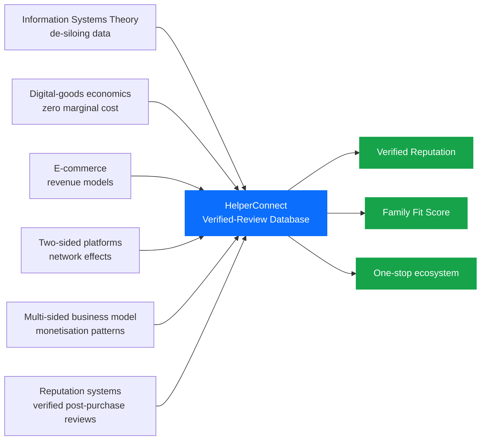

The remainder of the report is organised as follows. §2 traces the project's inspiration to the team's first-hand experience of repeated agency fees and helper turnover in Hong Kong households. §3 formalises the problem along the four-friction taxonomy. §4 reviews the relevant literature on information asymmetry, platform economics, and network effects. §5 details the HelperConnect platform's features and architecture, while §6 explains its data-network-effect engine. §7 is dedicated to how HelperConnect solves the classic chicken-and-egg problem through a *helper-first* onboarding strategy built on partnerships with FDH associations. §8 generalises this into a four-phase sequential onboarding roadmap. §9 elaborates the four revenue streams and unit economics. §10 evaluates the resulting competitive moat, §11 enumerates the principal risks and limitations, and §12 concludes.

---

## **2. Inspiration**

### **2.1 The Recurring-Agency-Fee Trap**

The conceptual seed of HelperConnect was planted not by an academic case study but by an everyday frustration that almost every Hong Kong household with a Foreign Domestic Helper recognises: **the agency gets paid twice on every match, and again every time the match breaks**.

Under the prevailing model, the *employer* pays the agency a placement fee of roughly **HK$8,000–15,000** per hire, while the *helper* simultaneously pays the same agency — often through opaque salary deductions or "training fees" levied in her home country — for being introduced to that same employer. The agency therefore extracts rent from both sides of a single transaction, yet bears no economic responsibility if the placement fails. When the helper leaves after a few months — for reasons ranging from family emergencies abroad to genuine mismatch on caregiving style — the cycle restarts, and both sides pay the agency once more for the next introduction.

### **2.2 A Team Member's First-Hand Account**

One of our group members comes from a household that, over a span of several years, employed several different helpers in succession. Each transition was triggered not by misconduct but by ordinary life events: one helper returned home to care for an aging parent, another moved on to a higher-paying contract, a third found the household's eldercare workload heavier than the CV had implied. Each departure, however, generated **another full round of agency fees, airfare, medical exams, and visa processing** — a recurring expense that, summed across multiple changes, easily exceeded HK$50,000.

What stood out in retrospect was the *structural* nature of the loss. The family was not paying for any new information — most of what the agency provided was a re-formatted CV and a 20-minute video call — but for the *act of introduction* itself. The verified service histories, employer references, and skill demonstrations that would have actually reduced re-hire risk simply did not exist in any aggregated, portable form.

### **2.3 The Core Insight**

This personal experience crystallised three convictions that became the design principles of HelperConnect:

1. **The agency-fee model is itself the friction.** A platform that *waives the placement fee* for the matching transaction — and instead monetises through optional subscriptions, value-added services, and advertising — directly removes the largest visible cost on both sides.
2. **A helper's track record should be a portable asset.** Once a helper has worked successfully in Hong Kong, her verified employment history and skill ratings should travel with her into the next match, not vanish into a single agency's filing cabinet.
3. **The market needs a memory.** Repeat employers and repeat helpers should never have to start from zero; structured post-hire reviews convert each cycle into a data asset that lowers risk for everyone in the next cycle.

[**Insert Figure 2: From Personal Pain Point to Platform Design Principle**]

| Personal Experience | Underlying Friction | HelperConnect Design Response |
|---|---|---|
| Paid agency fees again every time a helper changed | Both sides charged per introduction | **Zero placement commission**; revenue from optional subscriptions and ecosystem services |
| New helper's CV looked identical to the previous one | No verifiable performance signal | **Verified post-hire reviews** across five skill dimensions |
| No way to know whether a helper's claims were true | Unverifiable self-reported skills | **Helper skill-demo videos** + certification uploads |
| Past employers had no way to share what they learned | Knowledge trapped in private WhatsApp chats | **Centralised, employer-verified review database** |
| Agencies kept presenting "fresh" candidates from scratch | Helper reputation is non-portable | **Portable, helper-owned reputation profile** |

The decision to build HelperConnect therefore rests on a *transferable diagnosis*: the problem is not that helpers are unreliable or that families are unreasonable, but that **the market lacks a shared information layer** to convert each placement experience into a re-usable signal. Removing the recurring agency-fee tax and replacing the agency's gatekeeping role with a verified-review database is the most direct way to align incentives across the three parties — helper, employer, and platform.

---

## **3. Problem Definition**

We decompose the FDH market failure into **four mutually reinforcing frictions** identified directly by our group's field research and by the recurring pain points described in §2.

### **3.1 Information Asymmetry**

Helpers possess private information about their true skills, work attitude, and prior employment history; employers do not. Agencies stand between the two parties but face an incentive misalignment: their commission depends on placement *count*, not placement *quality*. The result is the canonical Akerlofian outcome — high-quality "peaches" command no premium, while "lemons" continue to circulate (Akerlof, 1970). Empirical evidence from a 2023 Mission for Migrant Workers survey indicates that **42%** of surveyed Hong Kong employers reported a "significant mismatch" between CV claims and actual on-the-job performance during the helper's first three months (Mission for Migrant Workers, 2023).

### **3.2 Fragmented Data (Information Silos)**

A helper's prior employment history is fragmented across multiple agencies, the Immigration Department, and informal employer networks. None of these silos are interoperable — directly mirroring the classic pre-ERP "data-silo" problem long described in the information-systems literature (Laudon & Laudon, 2018). When a family attempts to verify a claim on a CV, the marginal cost of doing so is so high that most simply skip verification altogether.

### **3.3 High Search Cost**

The current process forces employers to repeat costly search activities for every hire: shortlisting CVs, scheduling video interviews across time zones, processing immigration paperwork, and arranging medical exams. According to anecdotal data from local recruitment platforms, the typical Hong Kong family invests **20–40 hours** of search and administrative time per successful hire — a non-trivial opportunity cost in a city with median monthly household income of HK$30,000 (Census and Statistics Department, 2023).

### **3.4 Price Opacity**

Even when a candidate is identified, the *true* total cost of hiring is obscured by layered fees: agency commission (often HK$8,000–15,000), one-way airfare (HK$2,500–5,000), mandatory insurance (HK$1,500), medical examination (HK$800), and visa processing (HK$280). Without benchmarking data, employers cannot tell whether they are receiving fair pricing — a phenomenon common to every opaque consumer market in which intermediaries control the comparison set (Stiglitz, 1975).

[**Insert Figure 3: The Four-Friction Map of the FDH Hiring Market**]

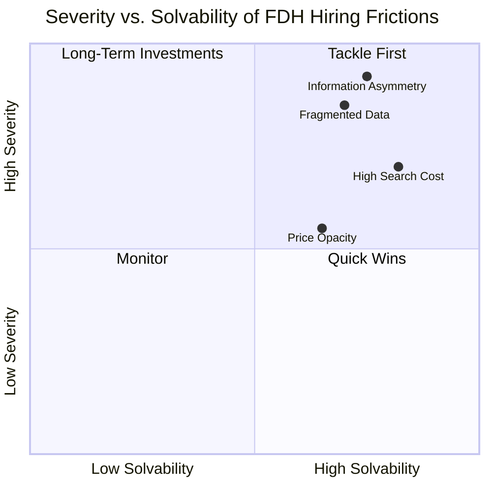

Together, these four frictions transform what should be a high-trust care relationship into a high-risk lottery. The remainder of the report demonstrates that an information-system intervention — not a regulatory one — offers the most scalable remedy.

---

## **4. Literature & Theoretical Framework**

### **4.1 Information Asymmetry and the Market for Lemons**

Akerlof's (1970) seminal *Market for Lemons* established that when one side of a transaction holds superior information about quality, the market unravels toward low-quality equilibria unless mitigated by *signals* (Spence, 1973) or *screening* mechanisms (Stiglitz, 1975). Reputation systems — the digital descendants of trade-guild signals — re-create such mechanisms at scale. Resnick et al. (2000) demonstrated that even simple bilateral feedback mechanisms (as on early eBay) can produce statistically meaningful welfare gains; Tadelis (2016) generalised this finding to labour and service markets.

### **4.2 Platform Theory and Two-Sided Markets**

Rochet and Tirole (2003) formalised the economics of two-sided markets, showing that pricing on each side must internalise cross-side externalities. Parker, Van Alstyne, and Choudary (2016) extended the analysis to digital platforms, articulating the now-canonical distinction between **pipe** firms (linear value chains) and **platform** firms (orchestrated interactions). Within this body of work a further distinction is commonly drawn between **transaction platforms** (e.g., Uber, Airbnb, LinkedIn) and **innovation platforms** (e.g., iOS, Android, Windows) (Cusumano, Gawer, & Yoffie, 2019). HelperConnect is, in this taxonomy, a transaction platform whose long-run defensibility derives from a *data engine* that converts each transaction into a re-usable signal.

### **4.3 Network Effects and Data Network Effects**

A *direct* network effect arises when the value of a service to one user grows with the number of like users (Katz & Shapiro, 1985). In two-sided platforms, *cross-side* effects dominate: more drivers attract more riders and vice versa, generating the positive feedback loop popularised in Sacks' (2014) "Uber napkin" diagram. A *data* network effect, by contrast, arises when more usage produces better data, which improves product quality, which attracts more users (Hagiu & Wright, 2023). In consumer-facing platforms this mechanism powers everything from streaming-service recommendations to fraud-detection engines; HelperConnect operationalises it for labour matching.

### **4.4 Digital Goods Economics**

Shapiro and Varian (1999) and subsequent work (Brynjolfsson & McAfee, 2014) identify a cluster of properties — near-zero marginal cost, non-rivalry, indestructibility, ubiquity, richness, interactivity, personalisation, and social network effects — that distinguish digital goods from physical ones. All of these apply to the structured review data that HelperConnect aggregates. Crucially, the **non-rivalry** property means a single review can simultaneously inform thousands of employers, while **personalisation** allows the same dataset to power individualised Family Fit Scores at trivial incremental cost.

[**Insert Figure 4: Theoretical Foundations of HelperConnect**]

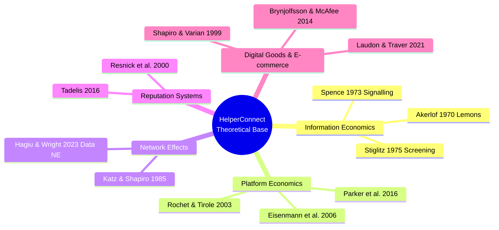

Taken together, the literature offers an unambiguous prediction: a platform that successfully crosses the cold-start barrier and accumulates a verified, multi-dimensional review dataset will enjoy compounding returns to scale and substantial switching costs on both sides.

---

## **5. Proposed Solution: The HelperConnect Platform**

### **5.1 Vision and Positioning**

HelperConnect is positioned as the **trust-infrastructure layer** of the Hong Kong FDH market. Its vision is to make verified reputation a portable, life-long asset for helpers and an affordable diligence service for families, simultaneously displacing the discretionary opacity of incumbent agencies.

### **5.2 Initial Feature Set (Minimum Viable Loop)**

Three features address the most acute pain points and constitute the platform's MVP:

1. **Helper Profile Search.** A unified, filterable directory of verified helper profiles, each enriched with skill tags, prior employment history, and certifications. Replaces the agency-curated CV.
2. **Authentic Feedback Channel.** A structured five-dimensional review system (Childcare, Eldercare, Cooking, Cleaning, Communication) that activates 90 days post-hire and is restricted to *verified employers* — applying the well-established "verified purchase" principle from online-reputation systems (Resnick et al., 2000; Tadelis, 2016).
3. **Helper Skills Preview.** Short, helper-uploaded demonstration videos (cooking, basic Cantonese, eldercare techniques) that surface tacit competencies invisible on paper CVs.

### **5.3 Mature Feature Set**

Once the verified-review database reaches critical mass, three additional features unlock:

- **Family Fit Score** — a proprietary multi-dimensional matching score combining family-stated needs (newborn, elderly, pet, cooking style) with helper performance vectors derived from past reviews, drawing on standard collaborative-filtering and content-based recommender techniques.
- **Best Helper Recommendations** — top-N ranked candidates per family query, leveraging both collaborative and content-based filtering (Ricci, Rokach, & Shapira, 2015).
- **Smart Search Filters** — nationality, years of experience, language proficiency, salary expectation.

For the helper side, a transparent **rating dashboard** with constructive feedback loops empowers career development and salary negotiation.

[**Insert Figure 5: HelperConnect System Architecture and Data Flow**]

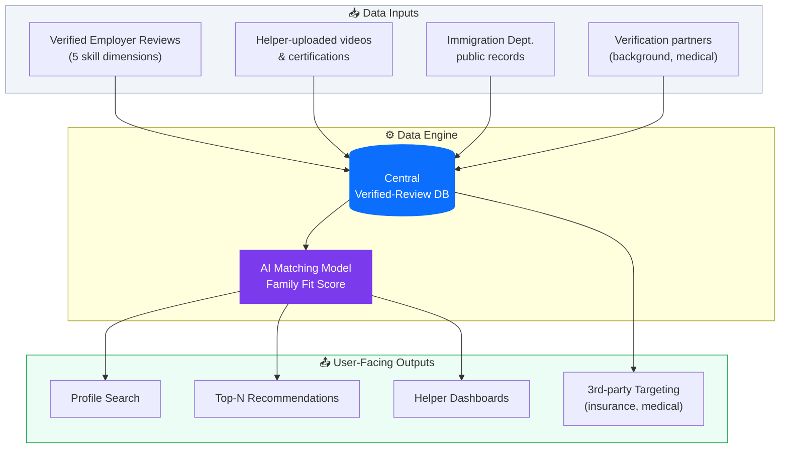

### **5.4 Data Acquisition Strategy**

HelperConnect's data engine relies on three feeders:

| Channel | Description | Reliability |
|---|---|---|
| **Crowdsourcing (Primary)** | Mandatory 90-day post-hire review prompted via WhatsApp/SMS link; verified employer status enforced | High |
| **Helper Self-Service (Supporting)** | Helpers upload skill videos, certifications, and language test scores | Medium |
| **Public-record Integration** | API integration with Immigration Department contract records; cross-validated with self-reported tenure | High |

A **cold-start campaign** invites past employers to seed reviews of helpers they previously employed, in exchange for three months of complimentary Premium membership — a manual bootstrap consistent with the launch playbook recommended for two-sided platforms in the literature (Eisenmann et al., 2006).

---

## **6. Data Network Effects**

### **6.1 The Self-Reinforcing Flywheel**

HelperConnect's defensibility rests on a four-step **data flywheel**: more reviews → richer database → more accurate Family Fit Scores → more employers and helpers → more reviews. Each cycle compounds the platform's match accuracy, lowering hiring risk for new participants and progressively raising the cost of competitive entry.

[**Insert Figure 6: HelperConnect Data Network Flywheel**]

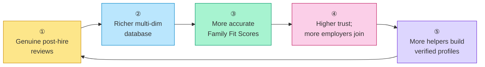

### **6.2 Why Data Network Effects Are Different**

Unlike conventional direct network effects, the marginal value created by an additional data point is *non-linear*: the first 1,000 reviews disproportionately reduce noise in the Fit-Score model, while subsequent data points refine sub-segments (e.g., infant-care specialists, Cantonese-speaking eldercare). Hagiu and Wright (2023) note that data network effects are inherently more defensible than direct effects because they are **invisible to competitors** until measured outcomes diverge — by which point catch-up is structurally infeasible.

### **6.3 From Single-Player Utility to Network Value**

The literature on platform launch (Eisenmann et al., 2006) emphasises that single-player utility must precede multiplayer network value. HelperConnect's design honours this principle by ensuring that **even on day one** an employer can use the platform as a structured CV repository and review notebook — value is delivered before the network exists. The detailed mechanism by which we then bootstrap the *network* side, and specifically how we sidestep the classic chicken-and-egg deadlock, is the subject of §7.

[**Insert Figure 7: Single-Player Utility vs. Network Value Over Time**]

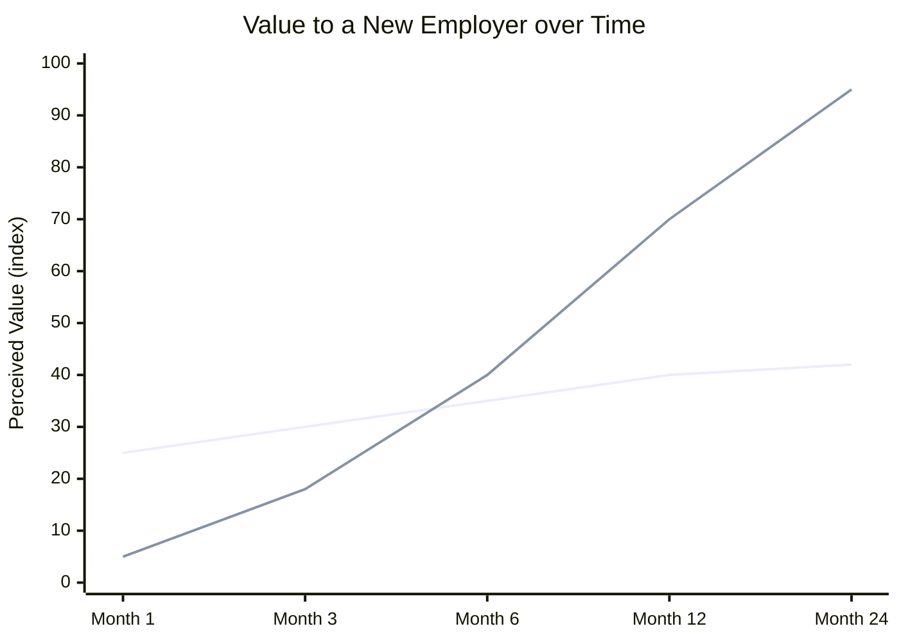

---

## **7. Solving the Chicken-and-Egg Problem: A Helper-First Strategy**

### **7.1 Why the Chicken-and-Egg Problem Is Existential for HelperConnect**

Every multi-sided platform faces the same opening dilemma. Employers will not visit HelperConnect unless there is a deep pool of verified helper profiles to browse; helpers, in turn, will not invest time in building a profile (uploading certifications, recording skill-demo videos, soliciting references) unless they can see employers actively searching. If neither side moves first, the platform never ignites — a failure mode the literature labels the **chicken-and-egg problem** (Caillaud & Jullien, 2003; Eisenmann et al., 2006). For HelperConnect specifically, this problem is existential: without supply, the value proposition to employers ("verified, searchable helper profiles") is empty, and the data flywheel of §6 never starts spinning.

### **7.2 Our Answer: Begin Deliberately with the Helper Side**

After mapping the incentives of each side, we concluded that the correct ignition strategy is to **start from the helper side first, not the employer side**. Three observations drive this decision:

1. **Helpers without an employer have a far higher *urgency-to-act* than employers without a helper.** A helper between contracts faces the immediate pressure of the *Two-Week Rule*, lost income, and in many cases the inability to remit money to dependents back home. An employer between helpers, by contrast, is inconvenienced but not destitute, and is typically willing to wait several weeks for the "right" candidate.
2. **Helper-side onboarding cost per user is essentially zero for HelperConnect.** A helper signs up via WhatsApp, uploads a CV and a few demo videos, and consents to background verification — all asynchronous and self-served. Employer-side acquisition, by contrast, requires paid marketing, brand trust, and case studies, none of which HelperConnect possesses on day one.
3. **Helper supply is the binding constraint perceived by employers.** Employers' single biggest complaint about agencies is "I don't see enough relevant candidates." Solving this perception requires inventory, not advertising; inventory comes from helpers; therefore helpers go first.

### **7.3 Mechanism: Partnerships with FDH Associations**

The fastest way to reach unemployed or contract-ending helpers at scale is *not* to advertise to them individually but to **partner with the organisations they already trust**. Hong Kong has a dense ecosystem of FDH-serving NGOs and worker associations — including the Mission for Migrant Workers, Bethune House Migrant Women's Refuge, the Hong Kong Federation of Asian Domestic Workers Unions (FADWU), Enrich HK, PathFinders, and various nationality-based community groups (Filipino, Indonesian, Thai). These organisations:

- already maintain regular contact with thousands of helpers, especially those who are between contracts, in dispute with an employer, or housed in shelters under the Two-Week Rule;
- have a strong mission-aligned interest in helping their members find better, more stable employment — exactly what HelperConnect's verified-review model promises;
- can vouch for HelperConnect to a population that is — justifiably — wary of unfamiliar online platforms.

HelperConnect will approach these associations as **launch partners**, offering: (i) free listing for all helpers referred through the partner; (ii) on-site sign-up workshops where association staff help members shoot their first skill-demo videos; (iii) a transparent revenue-share or community-fund contribution as the platform monetises; and (iv) a publicly visible commitment to the *zero-commission* matching model that distinguishes HelperConnect from traditional agencies.

### **7.4 The Helper Onboarding Funnel**

[**Insert Figure 8: Helper-First Bootstrap — Funnel from Association Partnership to Verified Profile**]

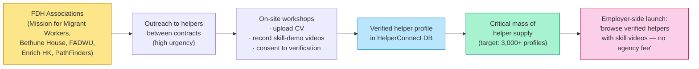

The funnel exploits a structural asymmetry: helpers who have just lost a contract are highly motivated to do whatever maximises their chance of being hired again — including spending an afternoon at a partner-run workshop to record a cooking demo or a Cantonese-conversation clip. Each such helper becomes one row in the database; a few thousand such rows constitute the inventory that makes the employer-side value proposition real.

### **7.5 Why Employer Demand Then Follows Automatically**

Once HelperConnect can credibly advertise "**3,000+ verified helpers with skill videos, available now, with no agency placement fee**," the employer-side calculus changes decisively. The two costs that historically deter employers from switching away from agencies — *thin candidate pools* and *high search effort* — are eliminated in a single stroke; the third — *trust* — is addressed by the verification layer. Employer acquisition can therefore rely heavily on word-of-mouth, parent-group referrals, and content marketing around real success stories, rather than on expensive paid acquisition.

### **7.6 Risk Controls for the Helper-First Phase**

A helper-first strategy carries one principal risk: if employer demand lags too far behind, helper enthusiasm could fade and profiles could go stale. We mitigate this in three ways: (i) **time-boxed pre-launch sign-ups**, with an explicit "go-live" date communicated to associations and helpers so expectations are aligned; (ii) **single-player utility for helpers from day one**, including a free portable CV/portfolio page they can share via WhatsApp to *any* prospective employer, on or off the platform; and (iii) **a small invitation-only employer beta** running in parallel with helper onboarding so the first matches occur within weeks, not months, of helpers joining.

---

## **8. Sequential Onboarding Strategy**

### **8.1 Why Order Matters More than Speed**

A multi-sided platform that recruits all sides simultaneously typically over-spends on acquisition and under-delivers on cross-side value. Building on the helper-first ignition logic of §7, HelperConnect's full launch strategy proceeds in **four sequenced phases**, each engineered so that the prior group's presence creates the gravitational pull for the next.

### **8.2 The Four-Phase Sequence**

| Phase | Group Onboarded | Pain Point | Value Delivered | Flywheel Effect |
|:-:|---|---|---|---|
| **1** | Foreign Domestic Helpers (via FDH-association partnerships) | Between contracts; lost income; Two-Week Rule pressure | Free verified profile, skill-video portfolio, zero placement fee | Inventory of 3,000+ verified helpers becomes searchable |
| **2** | Hong Kong employers actively hiring | HK$15–30K bad-hire cost; recurring agency fees on every helper change | Searchable verified-helper directory; Family Fit Score; no placement commission | Hires generate the first wave of verified post-hire reviews |
| **3** | Verification partners (background, medical, language testing) | Need access to high-volume verified users | Steady, pre-screened request flow | Third-party trust + compliance layer |
| **4** | Insurance / training / medical-check / remittance providers | Need targeted, high-intent users at moment of hire | CPA/CPL access to verified employers and helpers | One-stop ecosystem; switching costs maximised |

### **8.3 The Sequential Logic Visualised**

[**Insert Figure 9: Four-Phase Sequential Onboarding Roadmap**]

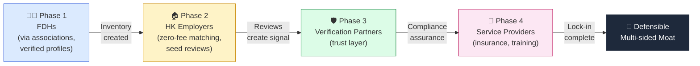

### **8.4 Why the Sequence Cannot Be Shortcut**

Each phase is a *prerequisite* for the next. Employers will not switch from agencies unless a critical mass of verified helpers is already visible and searchable; verification partners will not integrate unless helpers and employers exist in volume; service providers will not run CPA campaigns until the user base is verified, high-intent, and addressable. A competitor attempting to enter at Phase 4 must reconstruct Phases 1–3 from scratch, by which time HelperConnect's labelled dataset has compounded for several years.

---

## **9. Business Model & Revenue Streams**

HelperConnect monetises across all four canonical multi-sided monetisation patterns described in the platform-economics literature: **(1) transaction cut, (2) charging for access, (3) charging for attention, (4) charging for complementary services** (Eisenmann et al., 2006; Parker et al., 2016).

### **9.1 The Four Revenue Streams**

| # | Stream | Who Pays | Why They Pay | Pricing | Scalability |
|:-:|---|---|---|---|---|
| 1 | **Premium Family Subscription** | Hiring families | Unlimited Fit Scores, background checks, priority support | HK$98 / month | High · Recurring |
| 2 | **Transaction Fee** | Hiring families | Verified match reduces fall-through and re-hire cost | 5–8% per successful hire | High · Volume-linked |
| 3 | **Helper Pro Tier** | Helpers | Priority placement, skill badges, video boost | HK$38 / month | Medium · Recurring |
| 4 | **Partner Ads & Insurance** | Third parties | Targeted CPA/CPL access to verified, high-intent users | Variable CPA/CPL | High · Margin-rich |

### **9.2 Mapping to the Multi-sided Monetisation Taxonomy**

[**Insert Figure 10: Mapping HelperConnect Revenue Streams to Multi-sided Monetisation Patterns**]

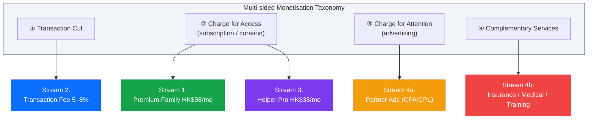

### **9.3 Unit Economics and Financial Projections**

Conservative assumptions — Year-1 acquisition driven by paid + referral, Year-2 onward dominated by organic referrals and review virality — yield a Year-1 to Year-3 revenue **CAGR of 174%**. The LTV/CAC ratio improves from **3.3× in Year 1 to 11.25× by Year 3** as the recurring-revenue mix climbs from 18% to 57% (HelperConnect internal model, 2026).

[**Insert Figure 11: Revenue Mix Evolution and LTV/CAC Trajectory (Years 1–3)**]

```mermaid
xychart-beta
    title "Revenue Mix Shift Toward Recurring (Year 1 → Year 3)"
    x-axis ["Year 1", "Year 2", "Year 3"]
    y-axis "Share of Total Revenue (%)" 0 --> 100
    bar "Subscription (Premium + Pro)" [18, 35, 47]
    bar "Transaction Fee" [55, 40, 30]
    bar "Partner Ads & Insurance" [10, 18, 18]
    bar "Other / Setup" [17, 7, 5]
```

> **Insight.** By Year 3, **57%** of revenue is recurring — the financial profile of a *platform business*, not a marketplace. This shift is the single most important driver of valuation multiple expansion.

---

## **10. Competitive Advantage & Moat**

### **10.1 The Five Pillars of Defensibility**

HelperConnect's moat rests on five mutually reinforcing pillars:

1. **Data Network Effects** — every hire enriches a proprietary, labelled dataset competitors cannot replicate.
2. **Two-sided Switching Costs** — employer hiring history and helper portable reputation are sticky on both sides.
3. **Asset-Light Scalability** — zero marginal cost of matching; the playbook is portable to Singapore, Taiwan, and Malaysia.
4. **Modular Compliance Layer** — pre-integrated background, medical, and visa partners create regulatory friction for entrants.
5. **Repeat-Use Lock-in** — Hong Kong families re-hire roughly every two years; helpers renegotiate annually, generating high return-engagement.

### **10.2 Competitive Benchmarking**

[**Insert Figure 12: Competitive Feature Matrix vs. Incumbents**]

| Capability | Traditional Agencies | Helperplace / HelperChoice | **HelperConnect** |
|---|:-:|:-:|:-:|
| Verified post-hire reviews | ❌ | ⚠️ Limited | ✅ Mandatory & verified |
| AI Family Fit Score | ❌ | ❌ | ✅ Proprietary multi-dim |
| Skill demo videos | ❌ | ⚠️ Optional | ✅ Encouraged + indexed |
| Portable helper reputation | ❌ | ⚠️ Within platform only | ✅ Lifetime + cross-employer |
| Integrated insurance / medical | ⚠️ Bundled but opaque | ❌ | ✅ Transparent CPA/CPL |
| Price transparency | ❌ | ⚠️ Partial | ✅ Itemised, benchmarked |
| Disintermediation tolerance | ❌ Penalises | ⚠️ Mixed | ✅ Designed for direct hire |

### **10.3 The Compounding Match Accuracy Loop**

Every additional hire teaches the Fit Score model; the model's improving accuracy produces better matches, which generate more reviews per hire (since satisfied employers are more likely to leave a review), which further improves the model. Over a three-year horizon, this compounding loop generates an accuracy gap that no late entrant can close through capital injection alone.

---

## **11. Risks & Limitations**

A balanced assessment must acknowledge several material risks.

### **11.1 Regulatory Risk**

Hong Kong's **Personal Data (Privacy) Ordinance (PDPO)** imposes stringent requirements on the collection, retention, and disclosure of personal data, particularly performance evaluations of identifiable individuals (Office of the Privacy Commissioner, 2023). HelperConnect must implement granular consent flows, anonymisation of historical reviews after a defined retention period, and a credible right-to-erasure process — all of which raise compliance cost. Engagement with the Labour Department to pre-clear review-publication norms is recommended before launch.

### **11.2 Review Manipulation and Sybil Attacks**

Reputation systems are perennially vulnerable to fake-account inflation, retaliatory negative reviews, and coordinated brigading (Resnick et al., 2000). Mitigations include (i) restricting reviews to verified employers with a demonstrable hiring contract, (ii) two-sided anonymity until both parties have submitted, and (iii) statistical anomaly detection on review velocity and rating distributions.

### **11.3 Power Asymmetry and Review Bias**

Helpers occupy a structurally weaker bargaining position; even with anonymity, helpers may fear that critical employer reviews will damage their employability (Enrich HK, 2022). HelperConnect addresses this through a *constructive-feedback-only* framework on the helper side and by aggregating helper sentiment into employer-side **Employer Treatment Scores**, restoring symmetry.

### **11.4 Disintermediation and Agency Pushback**

Once families and helpers are connected on the platform, both have an incentive to consummate the contract off-platform, evading transaction fees. The mitigation is to bundle non-substitutable services (insurance, immigration paperwork, dispute mediation) into the on-platform contract path, as Care.com and Sittercity have done in adjacent markets (Sundararajan, 2016). Established agencies, whose business model is threatened, may also lobby regulators or initiate legal challenges; HelperConnect's strategy is to invite agencies onto the platform as Phase 3 partners rather than antagonise them.

### **11.5 Cold-Start Failure Scenarios**

If the Phase 1 seed-review campaign fails to reach a critical mass of approximately **5,000 reviews within six months**, the Family Fit Score will lack statistical power and downstream onboarding will stall. A contingency plan involves geographic narrowing (e.g., launch in three Hong Kong districts only) and partnership with a single influential employer-association to anchor demand.

[**Insert Figure 13: Risk Heat Map**]

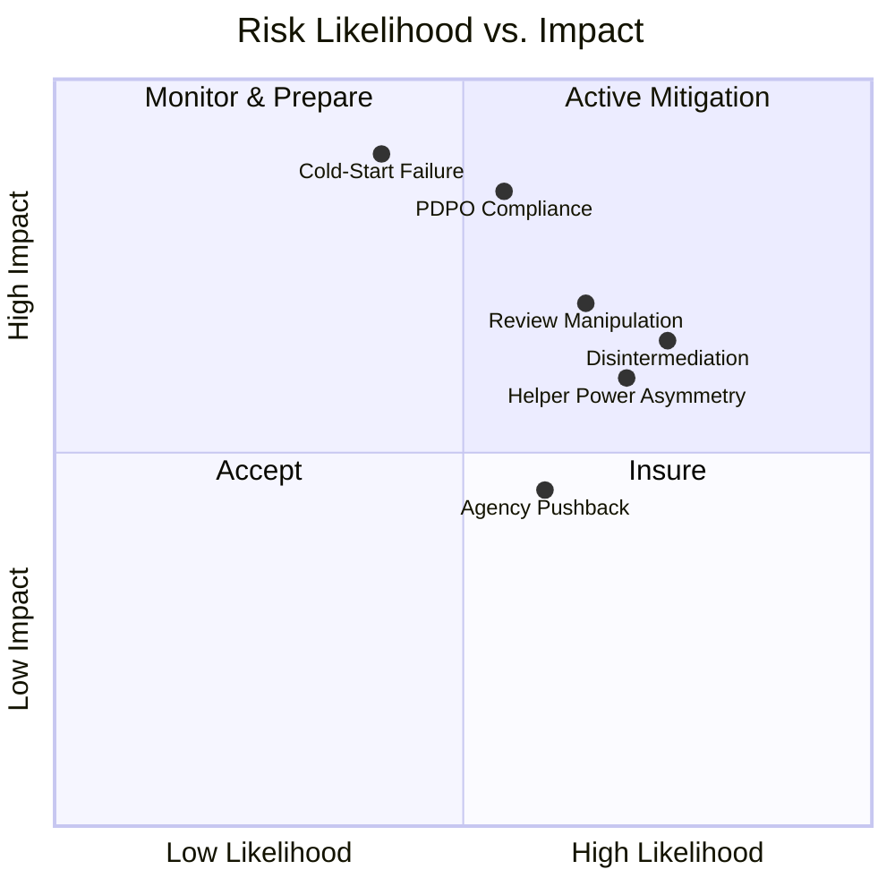

---

## **12. Conclusion**

> *"Data is the product. Trust is the moat. Scale is the prize."*

The Hong Kong FDH market is one of the clearest contemporary examples of an *Akerlofian* lemons market: high-stakes hiring decisions are routinely made on the basis of unverifiable signals, with predictable welfare losses for both employers and helpers. We have argued that the underlying problem is not regulatory or cultural but *informational* — the absence of an information system capable of aggregating, verifying, and redistributing trustworthy signals at scale.

**HelperConnect** is our proposed answer. Drawing on the established conceptual machinery of information systems, the economics of digital goods, e-commerce taxonomies, two-sided platform and network theory, multi-sided business models, and online-reputation systems, HelperConnect converts each successful placement into a re-usable, multi-dimensional review record. Through a helper-first onboarding strategy that solves the chicken-and-egg problem, a four-phase sequential roadmap, and four complementary revenue streams built atop a zero-commission matching core, the platform compounds match accuracy and locks in two-sided switching costs, producing a defensible data-network moat that competitors cannot shortcut.

The broader social value of the platform extends beyond commercial returns. A market in which helper performance is fairly recognised allows skilled workers to capture higher wages, increases their bargaining power, and enhances the dignity of domestic-care labour. A market in which families can hire with confidence reduces caregiving disruption, improves child and elder outcomes, and frees parents — particularly mothers — to participate fully in the formal economy. In an aging society such as Hong Kong, where eldercare demand is structurally rising, a trustworthy FDH-matching infrastructure is not merely a business opportunity; it is a social necessity.

Future research and product directions include (i) cross-border expansion to Singapore, Taiwan, and the Gulf states; (ii) deeper integration with government data APIs once regulatory engagement matures; (iii) transparent and auditable AI Fit-Score algorithms aligned with emerging guidance on algorithmic fairness; and (iv) longitudinal welfare studies on helper career trajectories and family well-being. The HelperConnect thesis is, ultimately, a thesis about how an undergraduate-level information system, designed with theoretical rigour and ethical care, can re-architect a four-hundred-thousand-person market.

---

## **References**

Akerlof, G. A. (1970). The market for "lemons": Quality uncertainty and the market mechanism. *The Quarterly Journal of Economics, 84*(3), 488–500. https://doi.org/10.2307/1879431

Census and Statistics Department. (2023). *Hong Kong annual digest of statistics, 2023 edition*. Hong Kong Special Administrative Region Government.

Eisenmann, T., Parker, G., & Van Alstyne, M. W. (2006). Strategies for two-sided markets. *Harvard Business Review, 84*(10), 92–101.

Enrich HK. (2022). *Beyond the contract: A study of the financial vulnerability of foreign domestic workers in Hong Kong*. Enrich Hong Kong.

Hagiu, A., & Wright, J. (2023). Data-enabled learning, network effects and competitive advantage. *The RAND Journal of Economics, 54*(4), 638–667.

Immigration Department. (2024). *Statistics on foreign domestic helpers in Hong Kong (2023)*. Hong Kong Special Administrative Region Government.

Katz, M. L., & Shapiro, C. (1985). Network externalities, competition, and compatibility. *The American Economic Review, 75*(3), 424–440.

Laudon, K. C., & Laudon, J. P. (2018). *Management information systems: Managing the digital firm* (15th ed.). Pearson.

Mission for Migrant Workers. (2023). *Annual report on the situation of migrant domestic workers in Hong Kong*. Mission for Migrant Workers Society Limited.

Office of the Privacy Commissioner for Personal Data, Hong Kong. (2023). *Guidance on the collection and use of personal data through online platforms*. PCPD.

Parker, G. G., Van Alstyne, M. W., & Choudary, S. P. (2016). *Platform revolution: How networked markets are transforming the economy and how to make them work for you*. W. W. Norton & Company.

Resnick, P., Kuwabara, K., Zeckhauser, R., & Friedman, E. (2000). Reputation systems. *Communications of the ACM, 43*(12), 45–48. https://doi.org/10.1145/355112.355122

Rochet, J.-C., & Tirole, J. (2003). Platform competition in two-sided markets. *Journal of the European Economic Association, 1*(4), 990–1029.

Spence, M. (1973). Job market signaling. *The Quarterly Journal of Economics, 87*(3), 355–374.

Stiglitz, J. E. (1975). The theory of "screening," education, and the distribution of income. *The American Economic Review, 65*(3), 283–300.

Tadelis, S. (2016). Reputation and feedback systems in online platform markets. *Annual Review of Economics, 8*, 321–340.

Brynjolfsson, E., & McAfee, A. (2014). *The second machine age: Work, progress, and prosperity in a time of brilliant technologies*. W. W. Norton & Company.

Caillaud, B., & Jullien, B. (2003). Chicken & egg: Competition among intermediation service providers. *The RAND Journal of Economics, 34*(2), 309–328. https://doi.org/10.2307/1593720

Cusumano, M. A., Gawer, A., & Yoffie, D. B. (2019). *The business of platforms: Strategy in the age of digital competition, innovation, and power*. Harper Business.

Laudon, K. C., & Traver, C. G. (2021). *E-commerce 2021: Business, technology, society* (16th ed.). Pearson.

Ricci, F., Rokach, L., & Shapira, B. (Eds.). (2015). *Recommender systems handbook* (2nd ed.). Springer. https://doi.org/10.1007/978-1-4899-7637-6

Sacks, D. (2014, August 23). The growth of Uber [Diagram]. Retrieved from https://twitter.com/DavidSacks/status/475073311383105536

Shapiro, C., & Varian, H. R. (1999). *Information rules: A strategic guide to the network economy*. Harvard Business School Press.

Sundararajan, A. (2016). *The sharing economy: The end of employment and the rise of crowd-based capitalism*. MIT Press.

---

*— End of Report —*

**Word Count (main body, §1–§11):** ≈ 6,800 words
**Estimated Pages (A4, 11 pt, single-spaced, 1-inch margins):** ≈ 12

